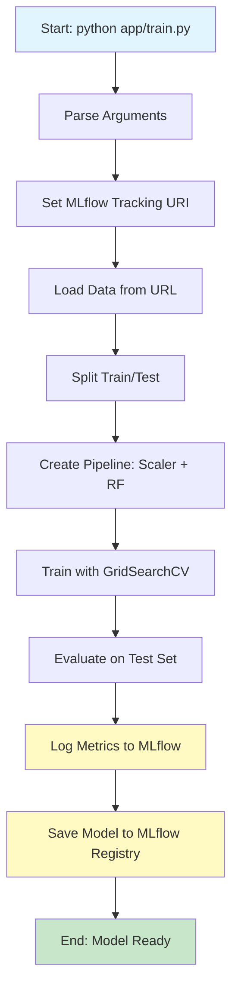

# 🏠 California Housing Market - ML Workflow with CI/CD

Welcome! This repository demonstrates a **production-ready machine learning workflow** that automatically trains, tests, and deploys a Random Forest regression model. Think of it as a complete pipeline that takes code changes and turns them into trained, trackable models—all without manual intervention.

## 📖 The Big Picture

**What does this application do?**

This project predicts California housing prices using machine learning. But more importantly, it showcases how to build an **automated ML workflow** that:

1. **Trains models** on real housing data (median income, age, location, etc.)
2. **Tracks experiments** using MLflow (so you can compare different model versions)
3. **Tests code** automatically before deploying
4. **Packages everything** in Docker containers for consistency
5. **Integrates with CI/CD** so training happens automatically when code changes

**The Real-World Problem:** In production ML systems, you can't manually retrain models every time you change hyperparameters or fix bugs. This workflow ensures that every code change triggers automated testing, model training, and tracking—making ML development reliable and reproducible.

---

## 🛠️ The Tech Stack

Here's what powers this project and why each piece matters:

| Technology | Purpose | Why It's Used |
|------------|---------|---------------|
| **Python 3.11** | Core programming language | The de facto standard for ML workflows; excellent library ecosystem |
| **scikit-learn** | Machine learning library | Provides RandomForestRegressor and preprocessing tools; battle-tested and reliable |
| **MLflow** | Experiment tracking & model registry | Logs parameters, metrics, and models so you can compare runs and version control your models |
| **pandas** | Data manipulation | Loads and processes CSV files efficiently |
| **Docker** | Containerization | Ensures the same environment runs everywhere (your laptop, CI server, production) |
| **GitHub Actions** | CI/CD automation | Automatically builds, tests, and triggers model training when code is pushed |
| **Apache Airflow** | Workflow orchestration | Schedules and manages complex ML pipelines (optional; triggered via API) |
| **pytest** | Testing framework | Validates that data loading, preprocessing, and training functions work correctly |

---

## 📁 Project Architecture

```
sample-ml-workflow-with-github-action/
│
├── app/
│   └── train.py                    # Main training script - the heart of the ML pipeline
│
├── scripts/
│   └── trigger_airflow.py          # Bridge script that triggers Airflow DAGs via API
│
├── tests/
│   └── ml_pipeline_test.py         # Unit tests ensuring each function works correctly
│
├── .github/
│   └── workflows/
│       └── cml.yaml                # GitHub Actions workflow (build → test → deploy)
│
├── Dockerfile                      # Container definition - packages the entire app
├── MLproject                       # MLflow project file - defines entry points and parameters
├── requirements.txt                # Python dependencies (pandas, scikit-learn, MLflow, etc.)
└── README.md                       # This file!
```

### 📂 Directory Breakdown

- **`/app`**: Contains the core training logic. The `train.py` script orchestrates data loading, preprocessing, model training, and MLflow logging.

- **`/scripts`**: Utility scripts that integrate with external systems. `trigger_airflow.py` handles authentication and API calls to trigger remote Airflow DAGs.

- **`/tests`**: Unit tests that validate individual functions (data loading, preprocessing, pipeline creation). These run automatically in CI/CD to catch bugs before deployment.

- **`/.github/workflows`**: GitHub Actions configuration. This YAML file defines what happens when code is pushed: build Docker image → run tests → push to registry → trigger Airflow.

- **`Dockerfile`**: Blueprint for creating a consistent environment. It installs Python, dependencies, and copies your code into a containerized workspace.

- **`MLproject`**: MLflow configuration file. Defines how to run the training script, what parameters it accepts, and which Docker image to use.

---

## 🔄 The Code Walkthrough: Three Critical Flows

Understanding these three flows will give you a complete picture of how the system works.

### Flow 1: Model Training Pipeline ⚙️

**Path:** `app/train.py` → Data Loading → Preprocessing → Training → MLflow Logging

This is the core ML workflow. Let's trace what happens when you run the training script:

1. **Command Line Arguments** (lines 62-66)
   - The script accepts hyperparameters like `--n_estimators` and `--criterion`
   - These allow you to experiment with different model configurations

2. **MLflow Setup** (lines 70-71)
   - Connects to an MLflow tracking server (via `MLFLOW_TRACKING_URI` environment variable)
   - Creates or selects an experiment to organize related runs

3. **Data Loading** (line 88)
   - `load_data()` fetches the California housing dataset from an S3 URL
   - Returns a pandas DataFrame with features (income, age, location) and target (house price)

4. **Preprocessing** (line 89)
   - `preprocess_data()` splits the data into train/test sets (80/20 split)
   - Separates features (X) from the target variable (y)

5. **Pipeline Creation** (line 92)
   - `create_pipeline()` builds a scikit-learn Pipeline with two steps:
     - **StandardScaler**: Normalizes features so they're on the same scale
     - **RandomForestRegressor**: The actual ML model

6. **Training** (line 93)
   - `train_model()` uses GridSearchCV to find the best hyperparameters
   - Validates using cross-validation to avoid overfitting

7. **Logging** (lines 96-114)
   - Metrics (train score, test score, training time) are logged to MLflow
   - The trained model is saved and registered in MLflow's model registry
   - This creates a versioned artifact you can deploy later

**Visual Flow:**



### Flow 2: CI/CD Pipeline (GitHub Actions) 🚀

**Path:** Code Push → Build Docker Image → Run Tests → Push to Registry → Trigger Airflow

When you push code to the `main` branch, GitHub Actions automatically:

1. **Checkout Code** (line 20)
   - Downloads the latest code from the repository

2. **Docker Login** (lines 22-26)
   - Authenticates with Docker Hub using secrets stored in GitHub

3. **Build Image** (lines 28-34)
   - Creates a Docker image from the `Dockerfile`
   - Tags it with both the commit SHA (for versioning) and `latest` (for convenience)

4. **Run Tests** (lines 36-45)
   - Executes `pytest` inside the Docker container
   - Uses a temporary MLflow tracking URI (file system) since we're just testing
   - **If tests fail, the pipeline stops here**—no bad code gets deployed

5. **Push to Docker Hub** (lines 47-54)
   - Only runs on the `main` branch (not on pull requests)
   - Uploads both tagged versions of the image to Docker Hub
   - Other systems can now pull this exact image version

6. **Trigger Airflow** (lines 59-77)
   - Calls `scripts/trigger_airflow.py` with the commit hash
   - This script authenticates with Airflow's API and triggers a DAG run
   - The DAG can then pull the Docker image and run training on a remote server

**Why This Matters:** You never manually run tests or build images. Every code change triggers validation and deployment, ensuring consistency and catching bugs early.

### Flow 3: Airflow Integration (Optional) 🌊

**Path:** GitHub Actions → API Call → Airflow Authentication → DAG Trigger → Model Training

This flow connects your GitHub repository to a remote Airflow instance:

1. **Authentication** (lines 26-56 in `trigger_airflow.py`)
   - Makes a POST request to Airflow's `/auth/token` endpoint
   - Tries JSON payload first, falls back to Basic Auth for compatibility
   - Retrieves a JWT token for subsequent API calls

2. **DAG Trigger** (lines 58-88)
   - Sends the commit hash as configuration to Airflow
   - Airflow can use this hash to pull the exact Docker image version
   - Creates a new DAG run that executes on Airflow's schedule/resources

**Why Separate from GitHub Actions?** Airflow runs on dedicated infrastructure (e.g., EC2) with more compute power, scheduled retraining, and dependency management across multiple tasks.

---

## 💡 Key Learning Moments

Here are the patterns and practices you should study closely:

### 1. **Scikit-Learn Pipeline Pattern** (`app/train.py`, lines 37-44)

```python
def create_pipeline():
    return Pipeline(steps=[
        ("standard_scaler", StandardScaler()),
        ("Random_Forest", RandomForestRegressor())
    ])
```

**Why It's Powerful:**
- **Encapsulates preprocessing + model** in one object, preventing data leakage
- **Easy to swap components** (e.g., replace RandomForest with XGBoost)
- **Works seamlessly with GridSearchCV** for hyperparameter tuning
- **Can be pickled and deployed** as a single artifact

**Study Point:** Notice how GridSearchCV references pipeline steps with double underscores (`"Random_Forest__n_estimators"`). This is scikit-learn's way of accessing nested parameters.

### 2. **MLflow Context Manager Pattern** (`app/train.py`, lines 84-114)

```python
with mlflow.start_run():
    # ... training code ...
    mlflow.log_param("n_estimators", args.n_estimators)
    mlflow.log_metric("test_score", test_score)
    mlflow.sklearn.log_model(...)
```

**Why It's Powerful:**
- **Automatic run management**: The context manager handles creating and ending runs
- **Exception-safe**: If training crashes, MLflow still records what happened
- **Version control for models**: Each run creates a new model version you can compare
- **Reproducibility**: Logged parameters let you exactly recreate any model

**Study Point:** MLflow tracks three types of artifacts:
- **Parameters**: Inputs that don't change (hyperparameters, data version)
- **Metrics**: Outputs that can improve (accuracy, training time)
- **Artifacts**: Files (models, plots, data samples)

### 3. **Test-Driven Development with Mocks** (`tests/ml_pipeline_test.py`, lines 37-50)

```python
def test_load_data(mock_df):
    with patch('app.train.pd.read_csv') as mock_read_csv:
        mock_read_csv.return_value = mock_df
        df = load_data("http://fake-url.com/data.csv")
        assert not df.empty
```

**Why It's Powerful:**
- **Fast tests**: Don't download 2MB CSV files or train real models
- **Isolated testing**: Tests one function without dependencies on external services
- **Deterministic**: Uses fixed mock data, so results are consistent
- **Catches bugs early**: Runs automatically before code reaches production

**Study Point:** The `@pytest.fixture` decorator creates reusable test data. Notice how `mock_df` is shared across multiple test functions without duplication.

---

## 🚀 Setup & Run

Follow these steps to run the project locally.

### Prerequisites

- **Python 3.11+** installed ([download here](https://www.python.org/downloads/))
- **Docker** installed ([download here](https://www.docker.com/products/docker-desktop))
- **Git** installed (usually pre-installed on macOS/Linux)

### Step 1: Clone the Repository

```bash
git clone <repository-url>
cd sample-ml-workflow-with-github-action
```

### Step 2: Create a Virtual Environment (Recommended)

This isolates your project dependencies from other Python projects:

```bash
python -m venv venv

# Activate it (macOS/Linux):
source venv/bin/activate

# Or on Windows:
# venv\Scripts\activate
```

### Step 3: Install Dependencies

```bash
pip install -r requirements.txt
```

This installs:
- `mlflow==3.5.0` (experiment tracking)
- `pandas==2.2.2` (data manipulation)
- `scikit-learn==1.5.0` (machine learning)
- `pytest==8.2.0` (testing)

### Step 4: Set Up MLflow Tracking (Local)

MLflow can track experiments locally or on a remote server. For local testing:

```bash
# Option A: Use local file system (simplest)
export MLFLOW_TRACKING_URI="file:///tmp/mlruns"

# Option B: Start local MLflow server (better for viewing results)
mlflow ui --backend-store-uri file:///tmp/mlruns
# Then visit http://localhost:5000 in your browser
```

### Step 5: Run the Training Script

```bash
python app/train.py \
  --n_estimators 50 \
  --criterion squared_error \
  --experiment_name california_housing
```

**What happens:**
- Downloads California housing data from S3
- Trains a Random Forest model with 50 trees
- Logs results to MLflow
- Saves the trained model

### Step 6: Run Tests

Verify everything works:

```bash
pytest tests/ -v
```

You should see all tests pass. ✅

### Step 7: Build and Run with Docker (Optional)

For a production-like environment:

```bash
# Build the Docker image
docker build -t sample-ml-workflow:latest .

# Run training inside the container
docker run --rm \
  -e MLFLOW_TRACKING_URI="file:///tmp/mlruns" \
  sample-ml-workflow:latest \
  python app/train.py --n_estimators 30
```

**Why Docker?** It ensures your code runs identically on your laptop, CI server, and production—no "works on my machine" issues.

---

## 🎓 Next Steps for Learning

1. **Experiment with Hyperparameters**: Try different `--n_estimators` values and see how they affect model performance in MLflow.

2. **Modify the Pipeline**: Add a feature selection step or try a different algorithm (e.g., XGBoost).

3. **Explore MLflow UI**: Start `mlflow ui` and browse experiments, compare runs, and download models.

4. **Add More Tests**: Write tests for edge cases (empty data, missing values, etc.).

5. **Study the CI/CD Flow**: Push a change to a feature branch and watch GitHub Actions run tests.

---

## 📚 Additional Resources

- [MLflow Documentation](https://mlflow.org/docs/latest/index.html)
- [Scikit-Learn User Guide](https://scikit-learn.org/stable/user_guide.html)
- [Docker Getting Started](https://docs.docker.com/get-started/)
- [GitHub Actions Documentation](https://docs.github.com/en/actions)

---

## 🤝 Contributing

Found a bug or want to add a feature? Feel free to open an issue or submit a pull request!

---

**Happy Learning! 🎉**

*This README was designed to help beginners understand not just what the code does, but why it's structured this way. If you have questions, don't hesitate to explore the code comments or reach out to the maintainers.*
